# 03. 검증 — Spectre 시뮬레이션 · DRC / LVS

## 1. 검증 단계 요약

| 단계 | 대상 | 방법 | 결과 |
|------|------|------|------|
| 1 | 6T Cell | DC sweep → Butterfly curve | SNM 확보 확인 |
| 2 | Row Decoder | Transient (tb_RowDecoder) | WL 단일 선택 · `E = 0`일 때 전체 LOW 확인 |
| 3 | SRAM_64bit Top | Transient (tb_SRAM_64bit, VDD = 3.3 V) | **WDATA = 5 → RDATA = 5** 일치 |
| 4 | Layout | Assura DRC | clean |
| 5 | Layout ↔ Schematic | Assura LVS | 일치 |
| 6 | 실리콘 | Raspberry Pi R/W 테스트 | 칩 수령 후 진행 |

---

## 2. 셀 안정성 — Butterfly Curve

교차 결합된 두 인버터의 VTC를 서로 축을 바꿔 겹쳐 그린 뒤, 두 곡선 사이에 들어가는
최대 정사각형의 한 변으로 **SNM(Static Noise Margin)** 을 읽습니다.
정사각형이 찌그러지거나 사라지면 셀이 노이즈에 의해 상태를 잃는다는 뜻입니다.

이 곡선이 셀 사이징(β ≈ 1.33, PR ≈ 0.67)의 근거이기도 합니다.
pull-down을 키우면 곡선 눈이 커지지만(read 안정), pull-up까지 커지면 write가 어려워지므로
두 조건을 함께 만족하는 지점에서 사이징을 확정했습니다.

---

## 3. Row Decoder 검증

| Testbench | 결과 파형 |
|---|---|
|  |  |

확인 항목:

- `A[3:1]`을 000 → 111로 스윕할 때 WL[0] ~ WL[7]이 **정확히 하나씩만** 어서트되는가
- `E = 0`일 때 8개 WL이 **모두 LOW**인가
- WL 전이 구간에 두 라인이 동시에 뜨는 글리치가 없는가

세 번째 항목이 특히 중요합니다. 글리치가 있으면 write 시 엉뚱한 행에 데이터가 새어 들어가고,
그 증상은 실측에서 "특정 행 전체 오염"으로 나타나 원인 추적이 까다로워집니다.

---

## 4. Top-level R/W 검증 (tb_SRAM_64bit)

### 4.1 Testbench 구성

| 전체 | 셀 영역 | WDATA 소스 | 랜덤 패턴 |
|---|---|---|---|
| 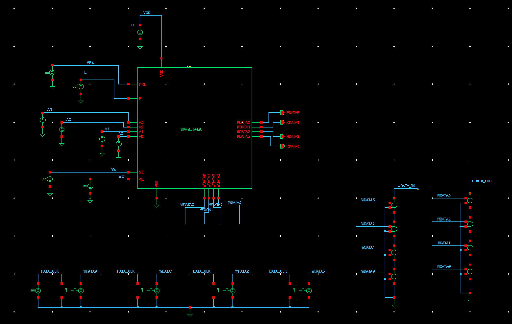 | 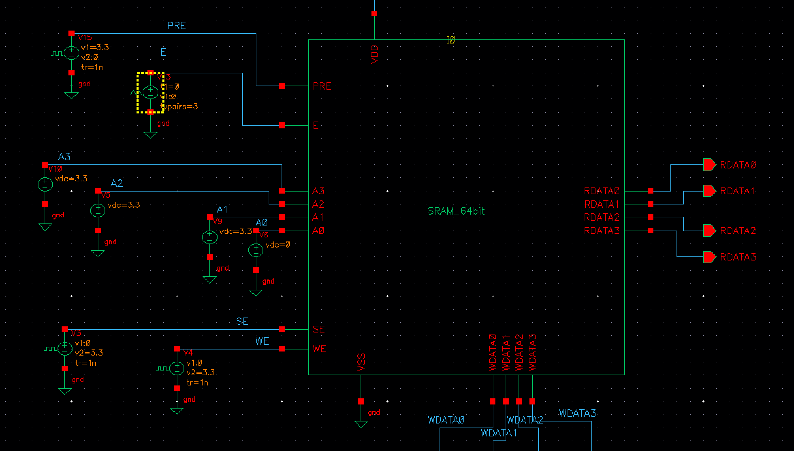 | 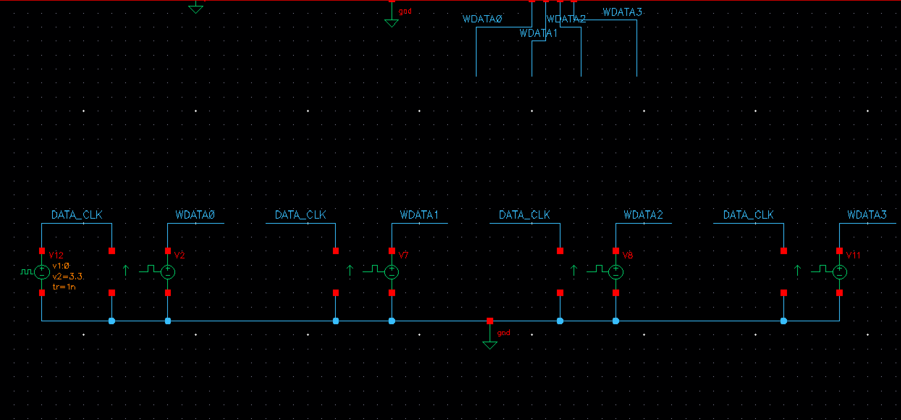 | 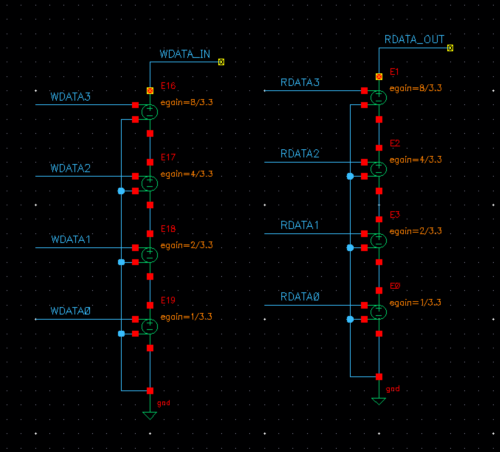 |

### 4.2 제어 신호 펄스

`PRE`, `E`, `WE`, `SE` 각각의 `vpulse` 설정입니다. Spectre에서는 **500 ns 펄스폭**으로 정상 동작을 확인했습니다.

| PRE | E | WE | SE |
|---|---|---|---|
| 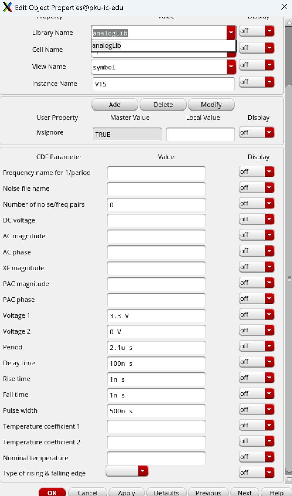 | 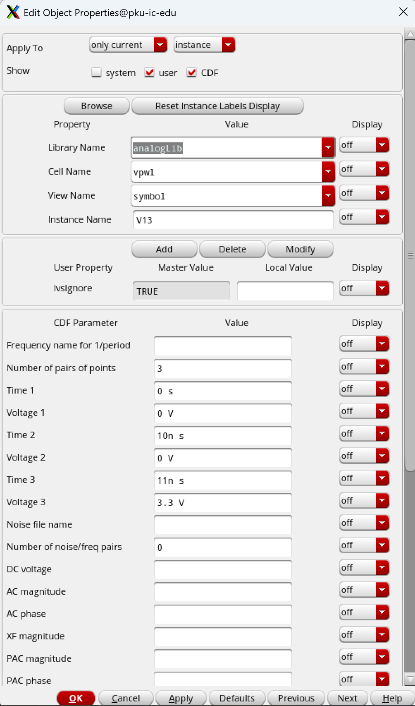 | 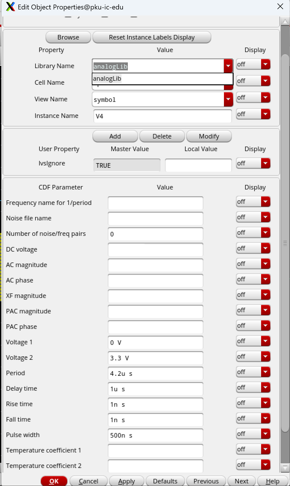 | 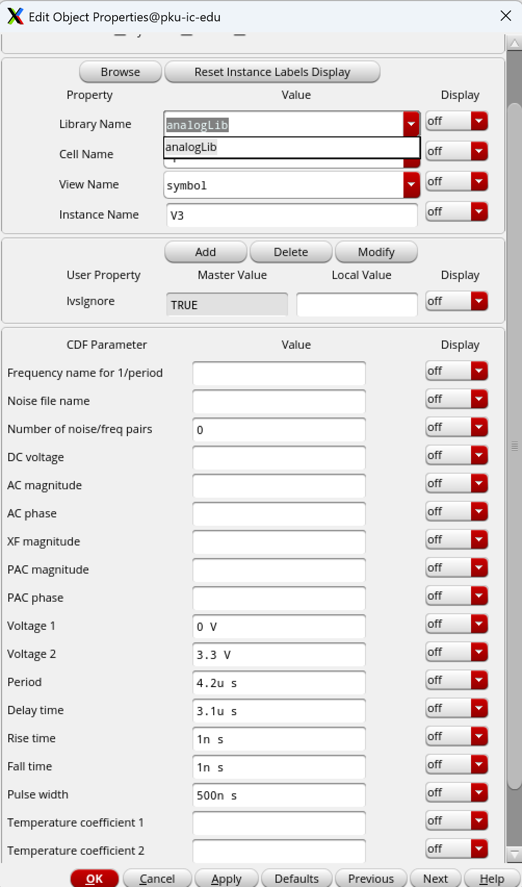 |

### 4.3 Transient 결과

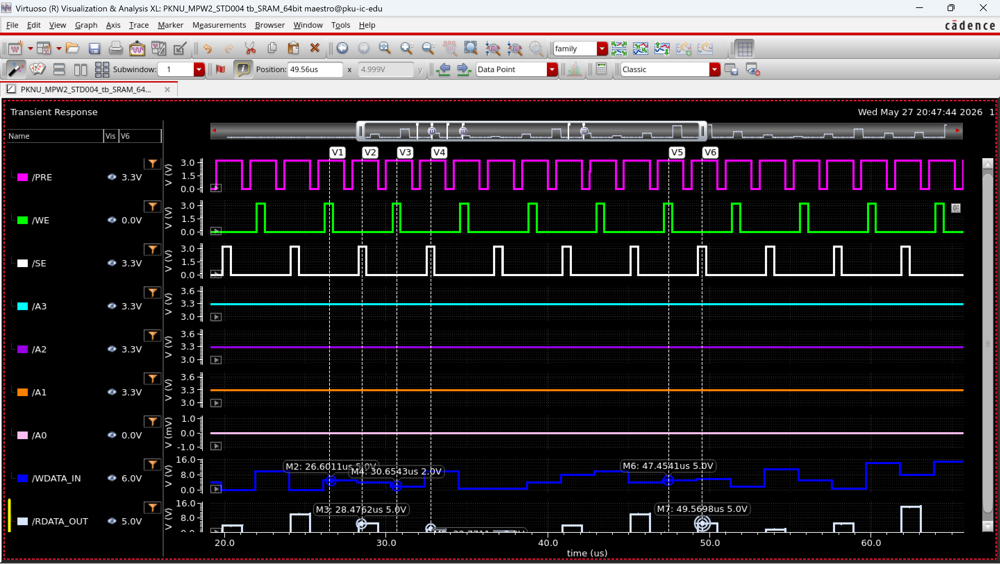

| 전체 구간 | 파라미터 |
|---|---|
| 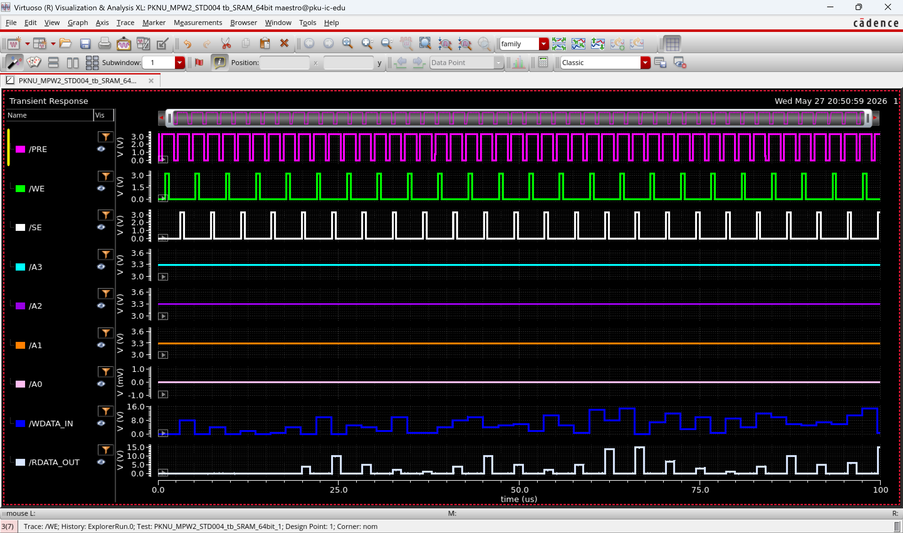 | 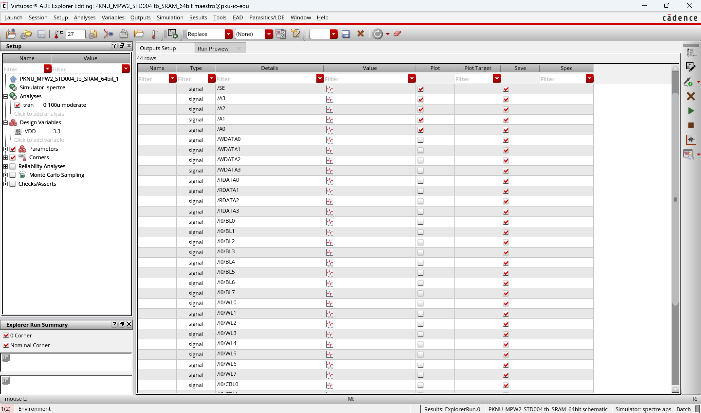 |

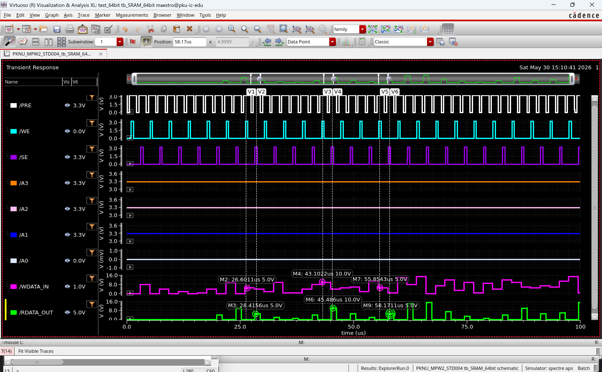

파형에서 확인한 내용:

- 모든 제어선이 **0 V ↔ 3.3 V 풀스윙**으로 동작 — 3.3 V 전원에서 정상 동작 확인
- `PRE`는 LOW 구간이 프리차지임을 파형으로 재확인 (Active-LOW)
- `WE` 펄스 이후 `SE` 펄스가 뒤따르는 write → read 반복 시퀀스
- 커서 측정: `WDATA_IN = 5` 시점 대비 `RDATA_OUT = 5` — **입력과 출력이 그대로 일치**
- `SE` 펄스 밖 구간에서 `RDATA_OUT`이 0으로 떨어짐 → Sense Amp에 래치가 없다는 점이
  파형으로 드러남. 실측 코드가 `SE = 1` 구간 안에서만 샘플링하도록 만든 근거입니다.

> **시뮬레이션(ns)과 실측(μs~ms)의 타이밍 차이**
> Spectre에서는 500 ns 펄스로 충분하지만, 라즈베리파이에서 Python으로 GPIO를 한 번 토글하면
> 수~수십 μs가 걸립니다. SRAM은 정적(static) 메모리라 느리게 동작시켜도 데이터가 유지되므로,
> 실측은 여유 있는 타이밍으로 시작해 `shmoo` 테스트로 줄여가며 마진을 측정합니다.

---

## 5. 물리 검증 — Assura DRC / LVS

| DRC | LVS |
|---|---|
| 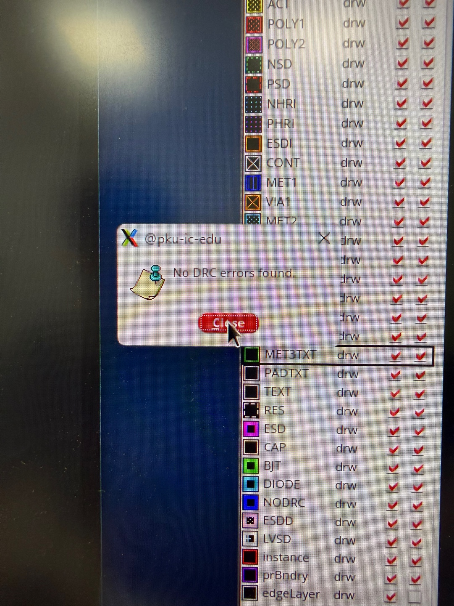 | 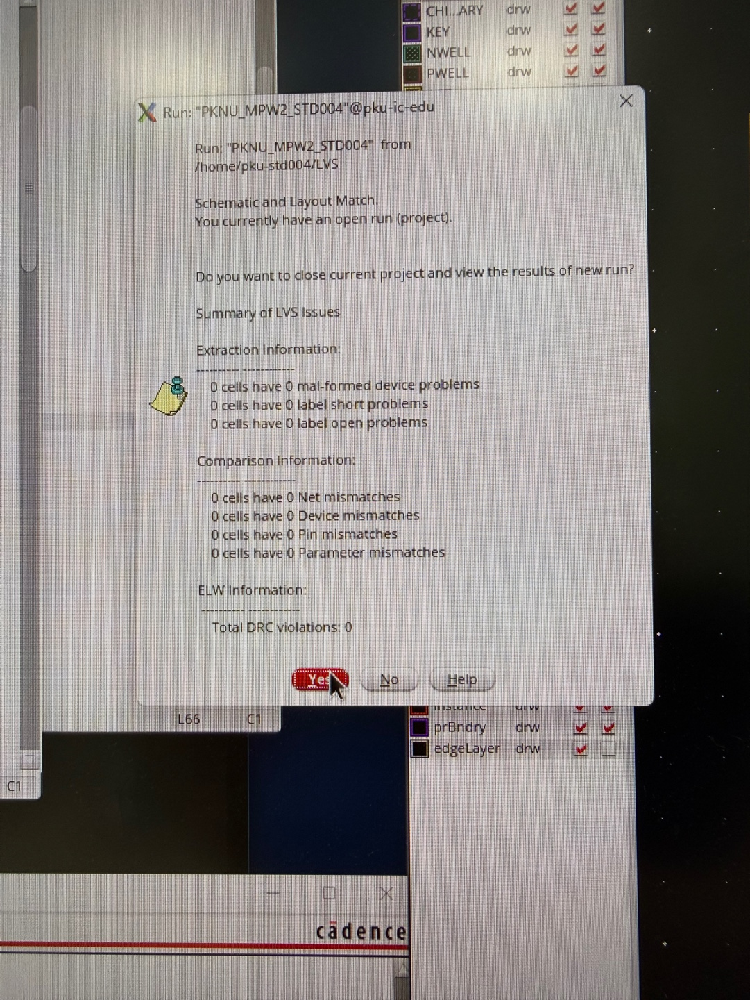 |

- **DRC** — NSPL 0.5 μm 2P3M 디자인 룰 기준 clean
- **LVS** — schematic ↔ layout 넷리스트 일치 확인

두 검증을 통과한 뒤 GDS를 stream out 하여 모아팹에 제출했습니다.

---

## 6. 다음 단계 — 실리콘 검증

칩 수령 후 [04_raspberry_pi_test.md](04_raspberry_pi_test.md)의 배선으로 테스트 보드를 구성하고,
[05_test_procedure.md](05_test_procedure.md)의 절차에 따라 R/W를 검증합니다.
`conn → smoke → addr → march → disturb → retention` 순서로 진행하며,
FAIL이 나오면 8×8 불량 맵과 자동 진단 힌트로 원인 블록을 좁힙니다.

실측 후 채워 넣을 항목:

- [ ] 동작 전압 범위 (VDD 스윕)
- [ ] Read access time 실측 (오실로스코프)
- [ ] 불량 셀 맵 및 수율
- [ ] Simulation vs Silicon 비교
