# 06. 실리콘 실측 결과 — Write / Read 동작 검증

> 측정일 2026-09-17 · 28-pin SOP 패키지 칩 · RIGOL MSO8204A 오실로스코프
> 원본 스코프 캡처는 [`images/12_measurement/raw/`](../images/12_measurement/raw/)에 그대로 보관했습니다.

## 1. 요약

| 항목 | 결과 |
|------|------|
| 칩 전원 | **VDD = 5 V (USB)**, E = 5 V 고정 |
| 제어 신호 | PRE · WE · SE를 라즈베리파이 GPIO **3.3 V로 직결** (레벨 시프터 없음) → 논리 1로 정상 인식 |
| 측정 주소 | A[2:0] = 000, 001, 010, 100 (각 주소 비트를 하나씩 1로) |
| 측정 비트 | 주소 4개 × bit 3 (랜덤 데이터), 주소 000 × bit 0·1·2 (고정 데이터) |
| Write → Read | **71 사이클 중 불일치 0** |
| 사이클 주기 | 약 9.2 ms (설정 9 ms + Python 오버헤드) |
| RDATA 레벨 | high 약 4.3 V / low 약 0.1 V |

---

## 2. 측정 환경

| 구성도 | 실제 환경 |
|---|---|
| 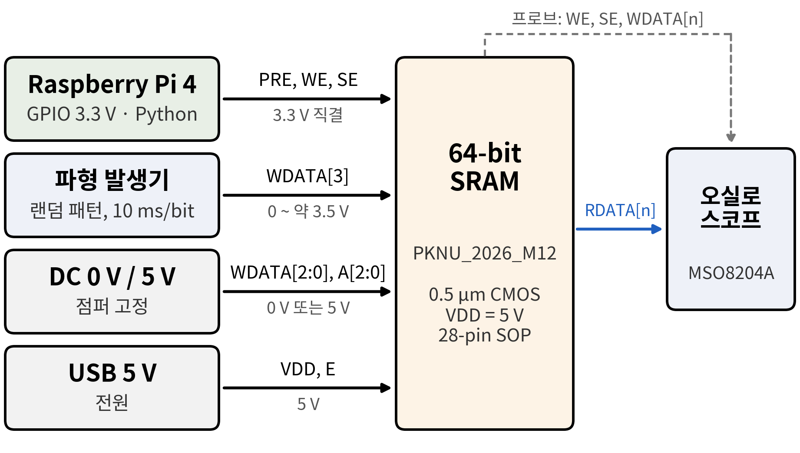 | 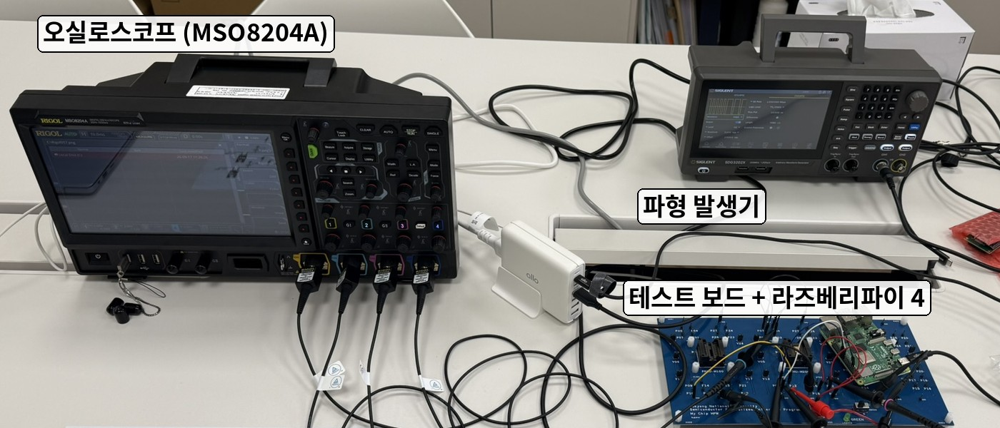 |

| 테스트 보드 | 칩 핀맵 (28-pin SOP) |
|---|---|
| 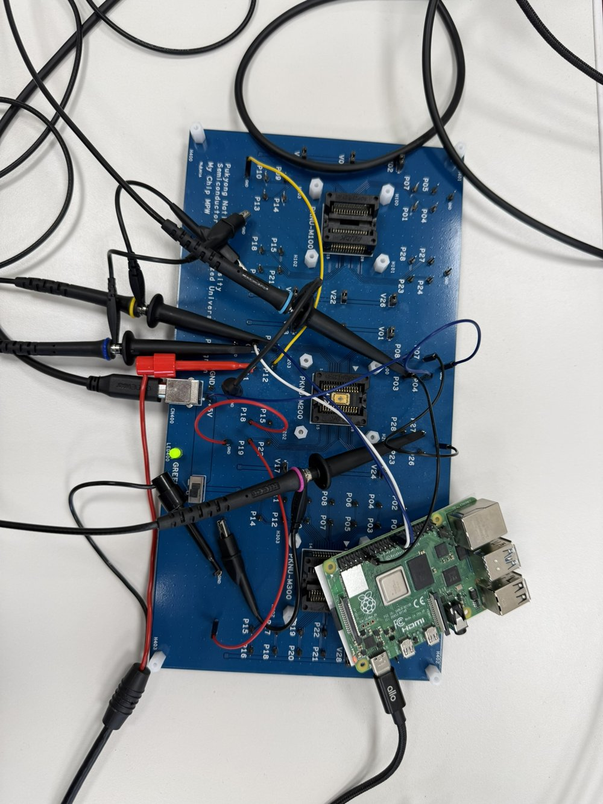 | 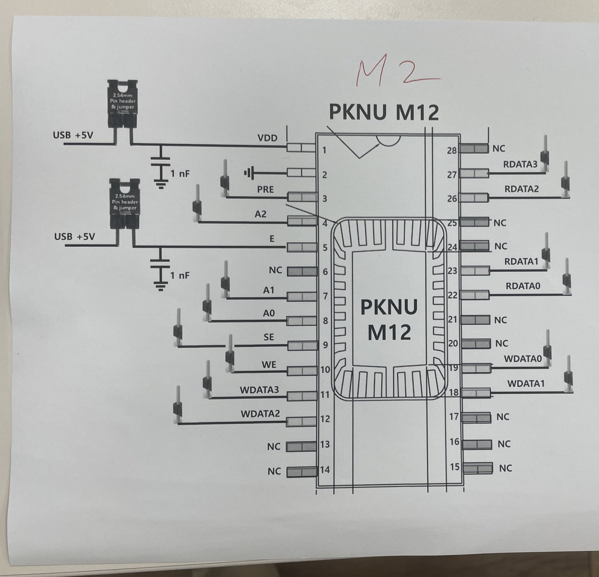 |

### 2.1 신호 연결

| 칩 핀 | 연결 | 레벨 |
|-------|------|------|
| `VDD` (1) | USB 5 V, 점퍼 + 1 nF 바이패스 | 5 V |
| `VSS` (2) | GND (라즈베리파이 · 파형 발생기 · 스코프 공통) | 0 V |
| `E` (5) | USB 5 V, 점퍼 → **HIGH 고정** | 5 V |
| `PRE` (3) · `WE` (10) · `SE` (9) | 라즈베리파이 4 GPIO 17 · 8 · 7 **직결** | 0 / 약 3.3 V |
| `WDATA[3]` (11) | 파형 발생기 — 비트 폭 10 ms 랜덤 패턴 | 0 / 약 3.5 V |
| `WDATA[2:0]` (12 · 18 · 19) | DC 고정: WDATA0 = 5 V, WDATA1 = WDATA2 = 0 V | 0 / 5 V |
| `A[2:0]` (4 · 7 · 8) | DC 고정 (측정마다 000 / 001 / 010 / 100으로 변경) | 0 / 5 V |
| `RDATA[3:0]` | 오실로스코프 CH4 | — |

스코프 채널: CH3 = WE(분홍), CH2 = SE(하늘), CH1 = WDATA[n] (노랑), CH4 = RDATA[n] (파랑).
채널이 4개뿐이라 비트마다 CH1/CH4 프로브를 옮겨가며 측정했습니다.

### 2.2 제어 타이밍 발생

[`test/sram_ctrl_timing.py`](../test/sram_ctrl_timing.py) (기본 타이밍, `rw` 모드) 사용.
E를 HIGH로 고정했기 때문에 **WE가 HIGH인 동안 선택된 셀에 WDATA가 계속 기록되고,
최종 저장값은 WE 하강 시점의 WDATA**가 됩니다.

```
        ┌ WRITE ──────────────────────────┐┌ READ ───────────────────────────────┐
  PRE ‾‾\____/‾‾‾‾‾‾‾‾‾‾‾‾‾‾‾‾‾‾‾‾‾‾‾‾‾‾‾\____/‾‾‾‾‾‾‾‾‾‾‾‾‾‾‾‾‾‾‾‾‾‾‾‾‾‾‾‾‾‾‾
  WE  ____________/‾‾‾‾‾‾‾‾\_______________________________________________
  SE  _____________________________________________/‾‾‾‾‾‾‾‾‾\______________
         1 ms  0.5   2 ms    0.5    1 ms    1 ms     2 ms      1 ms
```

| 구간 | 설정 | 스코프 실측 |
|------|------|------------|
| PRE low 폭 (`t_pre`) | 1 ms | 약 1.0 ms |
| WE high 폭 (`t_we`) | 2 ms | 약 2.0 ms ([커서](../images/12_measurement/raw/cursor_WE_width_2ms.png)) |
| SE high 폭 (`t_se`) | 2 ms | 약 2.0 ms ([커서](../images/12_measurement/raw/cursor_SE_width_2ms.png)) |
| 한 사이클 (write + read) | 9 ms | 약 9.2 ms ([커서](../images/12_measurement/raw/cursor_period_9ms.png), 10 사이클 평균 9.18 ms) |

---

## 3. 결과

### 3.1 제어 신호

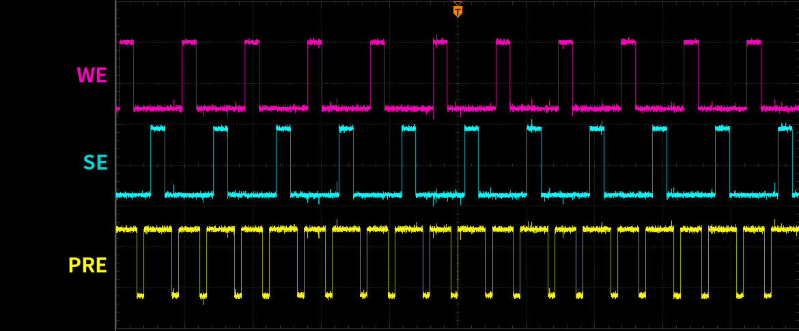

- PRE는 사이클마다 write · read 구간에서 한 번씩, 두 번 LOW로 내려갑니다.
- PRE LOW 구간과 WE, 그리고 WE와 SE가 서로 겹치지 않습니다 → 인터록 조건 유지.
- 세 신호 모두 high 레벨 약 3.3 V.

### 3.2 주소별 Write → Read (bit 3, 랜덤 데이터)

WDATA[3]의 비트 폭(10 ms)과 사이클 주기(약 9.2 ms)가 비동기라, WE 하강 시점에 샘플되는 값이
사이클마다 불규칙하게 바뀝니다. 즉 **매 사이클 0 또는 1이 무작위로 기록**됩니다.

| A[2:0] = 000 | A[2:0] = 001 |
|---|---|
| 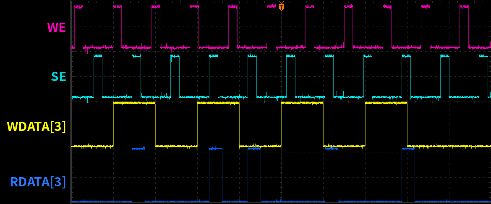 | 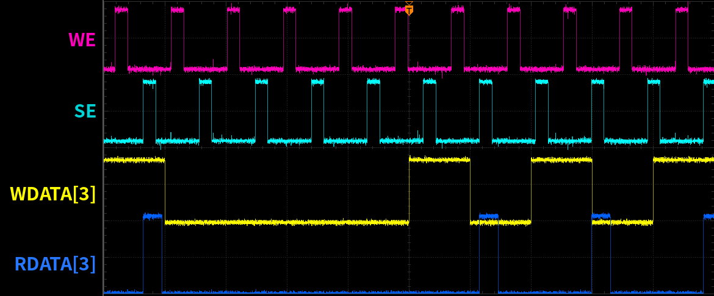 |
| **A[2:0] = 010** | **A[2:0] = 100** |
| 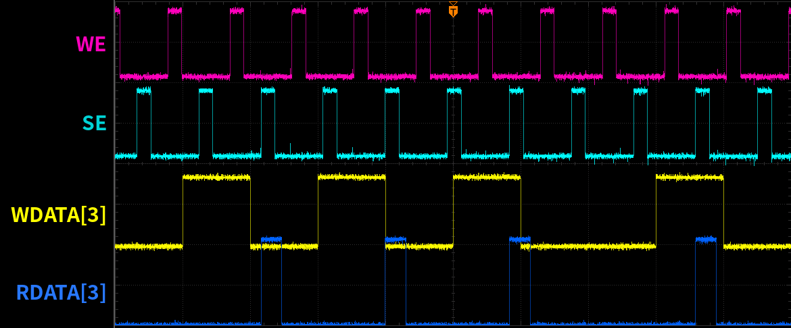 | 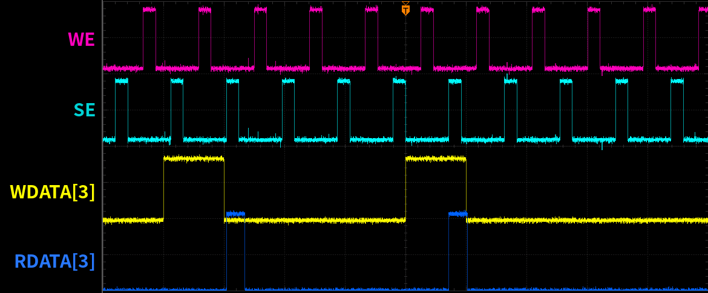 |

네 주소 모두 **SE가 올라갈 때마다 RDATA[3]가 직전 WE 하강 시점의 WDATA[3]와 같은 값**으로 출력됐습니다.

- A[2:0] = 000의 세 번째 사이클: WE가 올라갈 때 WDATA[3] = 1이었지만 WE 도중 0으로 바뀜 → **0이 판독**.
  WE 하강 시점의 값이 최종 저장된다는 설계 의도와 일치합니다.
- A[2:0] = 001의 여섯 번째 사이클: WE 하강(49.8 ms) 직후 WDATA[3]가 1로 바뀜(50.0 ms) → **0이 판독**.
  WE가 내려간 뒤의 데이터 변화는 셀에 영향을 주지 않습니다.

### 3.3 비트별 (A[2:0] = 000, 고정 데이터)

| bit 0 (WDATA0 = 5 V) | bit 1 (WDATA1 = 0 V) | bit 2 (WDATA2 = 0 V) |
|---|---|---|
| 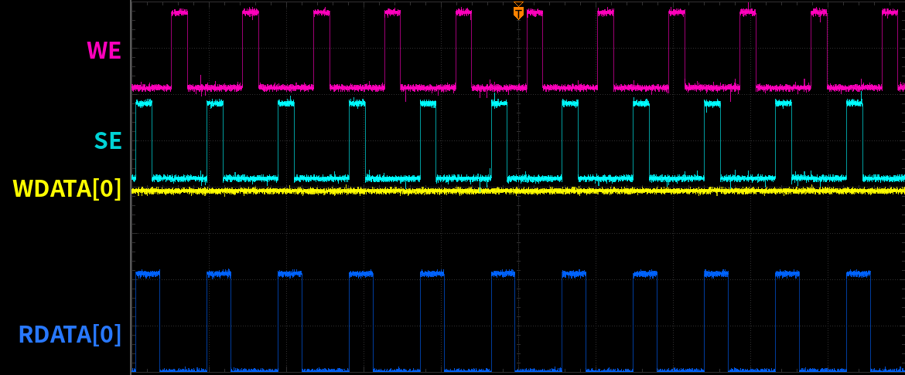 | 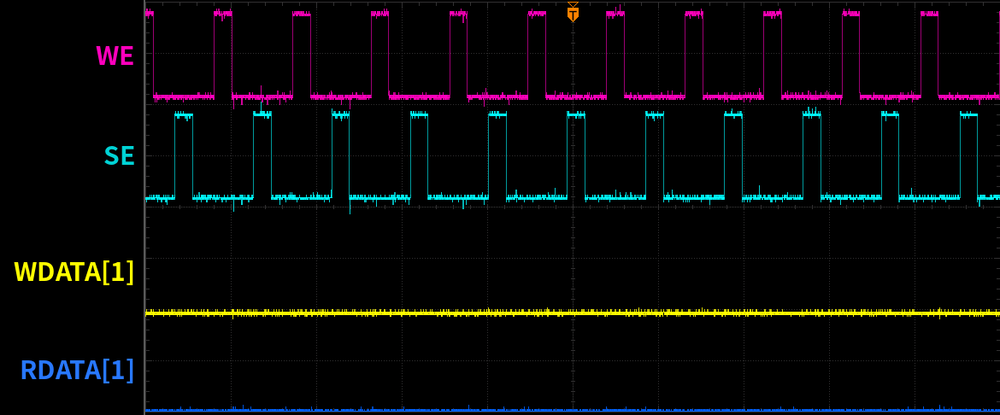 | 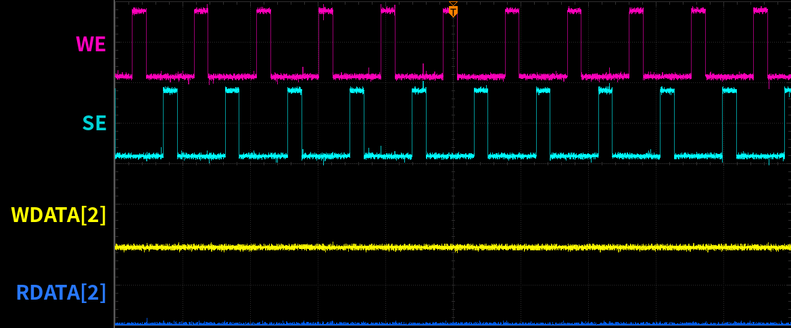 |
| 매 read 구간 RDATA0 = 1 | RDATA1 = 0 유지 | RDATA2 = 0 유지 |

### 3.4 결과 표

각 스코프 화면(100 ms)에 들어온 완전한 write → read 사이클을 에지 단위로 대조했습니다.
WL / 컬럼은 A2를 MSB로 가정한 값입니다 (주소 구조는 [01_architecture.md](01_architecture.md) 참고).

| A[2:0] | WL / 컬럼 | 비트 | 사이클 | 기록 1 / 0 | 불일치 |
|--------|-----------|------|--------|------------|--------|
| 000 | WL0 / Col 0–3 | 3 | 11 | 5 / 6 | 0 |
| 001 | WL1 / Col 4–7 | 3 | 10 | 3 / 7 | 0 |
| 010 | WL2 / Col 0–3 | 3 | 10 | 4 / 6 | 0 |
| 100 | WL4 / Col 0–3 | 3 | 10 | 2 / 8 | 0 |
| 000 | WL0 / Col 0–3 | 0 | 10 | 10 / 0 | 0 |
| 000 | WL0 / Col 0–3 | 1 | 10 | 0 / 10 | 0 |
| 000 | WL0 / Col 0–3 | 2 | 10 | 0 / 10 | 0 |
| **합계** | | | **71** | **24 / 47** | **0** |

> bit 1·2는 0만 기록했으므로 "0 → 0"만 확인한 것입니다. stuck-at-0 고장과는 이 측정만으로 구분되지 않습니다.
> 비트 0·1·2 측정 시 주소는 캡처 시각 기준으로 000이었다고 판단했습니다.

---

## 4. 관찰 사항

### 4.1 3.3 V 제어 신호로 5 V 칩 구동

VDD = 5 V인 칩에 라즈베리파이 3.3 V 출력을 레벨 시프터 없이 직접 넣었지만 PRE · WE · SE 모두 정상 인식됐습니다.
3.3 V는 5 V CMOS의 일반적인 VIH 기준(0.7 VDD = 3.5 V)보다 낮지만, 입력 패드 버퍼의 논리 문턱보다는 높기 때문입니다.
다만 이 구성은

- 노이즈 마진이 작고,
- 입력 버퍼 PMOS가 완전히 꺼지지 않아 정적 전류가 흐를 수 있으므로,

고속 동작이나 장시간 평가에서는 레벨 변환(또는 VDD 3.3 V 구동)을 권장합니다.

### 4.2 SE 하강 후에도 RDATA가 유지됨

시뮬레이션에서는 SE가 내려가면 RDATA도 바로 0으로 떨어졌지만, 실측에서는
**RDATA가 SE 하강 후 약 1 ms, 다음 PRE 하강 무렵까지 유지**됐습니다 (예: SE 14.5–16.7 ms, RDATA 14.5–17.6 ms).
Sense Amp에 래치가 없으므로, SE 차단 후 출력 노드에 남은 전하가 유지되다가 다음 프리차지 때 풀린 것으로 추정합니다.
유효 데이터는 여전히 **SE = 1 구간**으로 보는 것이 안전합니다.

### 4.3 측정 해상도의 한계

10 ms/div, 100 kSa/s 설정이라 시간 분해능이 약 10 μs입니다.
따라서 이 측정은 **기능(write/read 정합성) 검증**이며, read access time 같은 ns 단위 특성은 측정하지 못했습니다.

---

## 5. 남은 항목

- [ ] Access time · 최대 동작 속도 (Python GPIO 대신 FPGA/MCU 또는 파형 발생기로 제어 신호 생성)
- [ ] 동작 전압 범위 — VDD 스윕, VDD = 3.3 V 동작 확인
- [ ] 접근 가능한 8개 워드 전체 · 4비트 전체에 대한 0/1 기록 (March-C)
- [ ] 칩 현미경 사진
